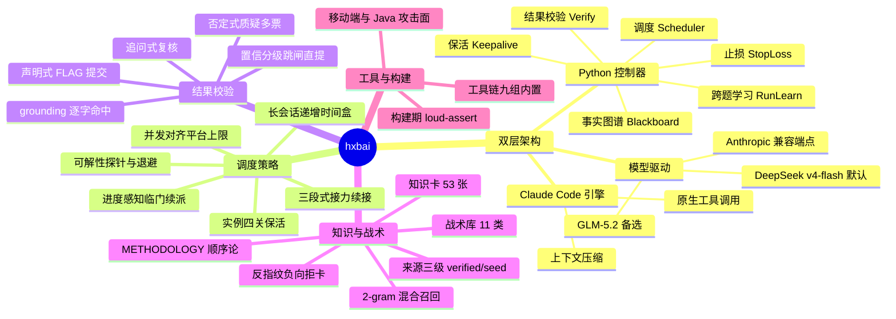

# hxbai — 自主安全靶场解题 Agent

**简体中文** | [English](README_EN.md)

hxbai 是一个面向 CTF / 渗透靶场的自主解题 Agent。给定一批题目和答题 API，它完成侦察、漏洞假设、利用、内网横向、结果校验和 flag 提交的全过程，无需人工介入。

系统由两部分组成：一个 Python 控制器负责事实抽取、结果校验、任务调度与跨题知识复用；Claude Code 作为内层执行引擎负责工具调用与上下文管理。二者通过 DeepSeek 或 GLM 的 Anthropic 兼容端点驱动，solver 与 verifier 使用同一模型。

hxbai 的目标是沉淀可迁移到不同靶场的解题方法与工程实现，避免针对单一基准做过拟合优化。

---

## 成绩 · Tsecbench v1

单模型 `deepseek-v4-flash` 全程自主，在腾讯安全云鼎实验室 Tsecbench v1 上综合得分 **93.4、排名第一**：

- Flag **70 / 74**（准确率 94.6%）、题目通过 **61 / 63**
- 约 **3.5 小时**（213 分钟）、17169 个 agent step，零人工介入
- 分类：Web 18/18、二进制 13/13、漏洞利用 9/9、云攻击 6/6、对抗规避 14/14 满分；多阶段渗透 10/14

成绩详情（第二次 · #11976）：<https://tsecbench.zc.tencent.com/agent/11976>

以下为两次跑测的排行榜与基准测试详情对比（第一次 #11775 → 第二次 #11976）：

**排行榜**

<table>
<tr>
<td align="center"><b>第一次 · Run 1</b><br></td>
<td align="center"><b>第二次 · Run 2</b><br></td>
</tr>
</table>

**基准测试详情**

<table>
<tr>
<td align="center"><b>第一次 · Run 1</b><br></td>
<td align="center"><b>第二次 · Run 2</b><br></td>
</tr>
</table>

---

## 系统结构图



---

## 运行原理

内层的工具调用循环由 Claude Code 提供，包含原生 tool-calling、上下文压缩和长上下文管理。控制器以 headless stream-json 模式启动 `claude` 进程，将其指向 DeepSeek 或 GLM 的 Anthropic 兼容端点，并解析其输出流：每条真实命令的执行结果被抽取为带来源标注的事实，同时提取候选 flag 及其对应的输出证据。控制器负责 Claude Code 不覆盖的部分：跨会话记忆、结果校验、全局任务调度。

一次运行的流程如下：

1. 调度器从答题 API 拉取题目列表，按难度和分值排序。
2. 每道题分配一个工作目录，写入工具清单 `CLAUDE.md` 和题目上下文，启动一个 Claude Code 子会话进行解题。子会话第一步做**可解性探针**（≤60s）：目标不可达且无本地可分析物时输出 `INFRA_BLOCKED` 标记，控制器收到后对该题退避、不再连续派会话。
3. 子会话的每条命令输出流回控制器，抽取为带来源标注的事实并落盘到该题的 `MEMORY.md`。
4. 子会话确证 flag 后，将其写入工作目录的 `FLAG` 文件。
5. 控制器读取 `FLAG` 文件中的候选，经三重校验（高置信候选跳闸直提）后调用答题 API 提交。
6. 未解出的题目挂起，后续轮次以递增时间盒重访；有已验证原语的"临门题"优先获得续派，符合四关准入的题保活实例（IP 不漂移、状态不重置）；会话间以三段式接力块（已达成原语 / 已证死路 / 下一步）续接，不重复侦察。

---

## 主要特性

### 结果校验：三重门 + 置信度分级

提交前对候选 flag 执行三级校验（`hxbai/verify.py`）：

- **grounding（代码校验）**：候选 flag 必须逐字出现在某条真实命令的输出中，否则判定为幻觉并拒绝。
- **否定式质疑**：一个独立的校验会话只接收候选和**产出该 flag 的那条命令的聚焦证据窗口**（并非会话开头摘要），看不到肯定方的推理，尝试反驳；采用多票机制，多数反驳则否决。
- **追问式复核**：逐项核对候选 flag 的来源命令、输出的唯一可解释性、格式匹配。

在此基础上按置信度分级处理：逐字出现在真实输出且格式正确的候选直接提交；仅大小写改写或仅出现在模型叙述中的候选强制走对抗校验；命中占位词特征或熵值过低的候选不提交；拼接/解密得到的 flag 允许附"各原料所在原始输出片段"作为证据形态。

### 声明式提交

控制器提交的候选来源于子会话写入 `FLAG` 文件的内容，以及 `<FinalAnswer>` 中明确声明的 flag。响应中的 session-id、request-id、二进制内嵌的诱饵字符串不会进入提交队列。配合按 flag body 去重、命中即停、单题错误提交次数上限，控制错误提交率。

### 分轮挂起与重访调度

调度器（`hxbai/scheduler.py`、`drivers/benchmark_driver.py`）在每一轮给每道未解题目一次访问，时间盒逐轮递增（首轮短会话批量收简单题，难题挂起；后续轮以更长会话重访）。时间盒序列只定义节奏、不限总轮数——重访持续到预算耗尽或题目全部解出/判定无望。

- **可解性探针与 INFRA_BLOCKED 通道**：worker 开局 60s 探活，目标持续不可达且无本地可分析物时输出 `INFRA_BLOCKED` 标记；控制器解析后对该题退避重探，不再制造会话风暴。
- **每 turn 时长自适应**：`HXBAI_SECS_PER_TURN` 作先验（flash=5 / glm=8），每会话记录实测 turn 速率，下个 visit 用实测值反推 turn 预算——换模型后长会话设计仍成立。
- **实例选择性保活**（`hxbai/keepalive.py`）：对"有已验证原语"的题保活实例（四关准入：有原语/配额未满/pending 不超限/不在尾段）；被抢占或回收时自动降级到"状态自描述 Handoff + 重放配方"的常开 fallback。实测不 close 则 IP 完全稳定——保活杜绝了"每波重打一遍"的最大空转源。
- **进度感知**：goal 图上 access 已满足、只差 flag 的临门题获得最高优先级与续派，突破发生在会话尾部时下一会话立即接力。

止损治理器（`hxbai/stoploss.py`）从多维度控制单题开销：单题活动时间预算、连续无新事实的会话数、目标连续不可达的访问数，以及**假设空间重复度**（连续会话探测命令高度相似 = 方向未收敛，强制换策略类）。任一维度触发即将该题移出重访队列。多 flag 链一旦已银入一个 flag 即转由"距上次 flag 的窗口"治理，避免临门题被平坦上限中途切断。并发数对齐平台的活跃实例上限。

### 跨题运行级学习

同一靶场的题目常共享基础设施与出题习惯（WAF 规则、内部命名、凭证与认证模式、产品家族）。控制器（`hxbai/runlearn.py`）将解出某题时确认的技术要点或环境特征按 ATT&CK 技术编号索引，在处理新题时按指纹召回；**负知识同样入库**——已证死路（工具不在场、协议被截断、路径 403 的原因）跨会话免疫，防止终局会话重踩。仅存储经校验确认的经验。

### 跨访问三段式续接

一道难题跨多次访问推进时，每次会话结束输出结构化接力块：**【已达成原语】**（最小复现命令，`$TARGET` 参数化）、**【已证死路】**（附一句为什么）、**【下一步】**（具体到可直接执行的一条命令/payload）。该块置于 `MEMORY.md` 顶部，下一次重访直接从"下一步"开始利用，不重复侦察；死路段在新会话 prompt 中显式列出。LLM 不可用时兜底合成自动降级为纯代码合成（新写脚本清单 + 最后命令），绝不让 visit 循环中断。

### 分类战术库（11 类 + 统一顺序论）

按 **11 个类别**（web、pwn、crypto、cloud、reverse、forensics、misc、pentest 多阶段渗透、evasion 对抗规避、**mobile 移动端**、**blockchain 区块链**）组织战术 playbook（`hxbai/playbooks.py`）。每个类别的 playbook 都前置注入同一段 **METHODOLOGY 工作顺序论**（可解性探针 → 全量读取含注释 grep → 题面名词翻译律 → 最便宜决定性优先 → 反停滞 → 验证 → Pivot 依赖链前瞻），保证"先做什么"永远有唯一答案；web/pentest 额外附加企业组件 CVE 目录（ENTERPRISE）。分类路由按**文件魔数 > 协议指纹 > banner > 题面措辞**（.apk/.dex→mobile、.sol→blockchain、Mach-O/ELF→reverse/pwn），多 flag 的 web 题自动提升为 pentest 杀伤链；未知形态有 UNKNOWN-SHAPE 兜底而不硬套最像的类。

### 知识卡库与混合语言召回（`hxbai/knowledge/`）

53 张结构化利用经验卡（指纹/利用步骤/关键 payload/前置条件/验证预言机/常见坑），覆盖产品级 CVE 一发（ComfyUI-Manager、HugeGraph、OFBiz、1Panel、泛微等）、题型链（登录注入旁信道、越权下载穿越、LFI 日志投毒、上传拿壳横向、JWT kid 伪造、检测对抗评分端点、自研 VM keygen、云凭证链）与方法论卡：

- **中英混合 2-gram 召回**：中文按相邻两字滑窗切分、英文按空格词，中文题面永不落空；指纹命中权重 ×3。
- **反指纹（anti_fingerprint）**：负向信号一票拒卡——"像 X 但出现 Y 就不是这张卡"，杜绝错误卡片带偏整个会话。
- **来源三级**：verified（本场解出回写）/ writeup（外部复盘提炼，首轮不注入）/ seed（手工卡 + 经人工复核的 writeup 提炼卡）；`force_recall` 强注门槛为指纹 ≥2 或指纹 ≥1 且总分 ≥6，首访只放 verified/seed。
- **去题目化纪律**：卡内容只写方法与题型指纹，不出现题目编号/实例用户名/叙事专名——保证换靶场即用。

### 单模型与网关模式

solver 与 verifier 使用同一 provider 和 key。通过 `HXBAI_PROVIDER` 在四个预设间切换：`deepseek`（deepseek-v4-flash，默认）、`deepseek-1m`（deepseek-v4-pro[1m] + 压缩窗口）、`glm`（glm-5.2）、`glm-1m`（glm-5.2[1m]）。

同一镜像支持本地和托管两种运行模式。设 `SOLVER_GATEWAY=1` 后，控制器将大模型 API 域名转换为 `http://<host>.tsecbench.gw` 并将 https 改为 http，用于只能经平台网关访问大模型的托管环境。

---

## 目录结构

```
Dockerfile          镜像构建
entrypoint.sh       容器入口：校验环境变量、可选启动 VPN、运行调度器
requirements.txt    控制器 Python 依赖
.env.example        运行时配置模板
hxbai/              控制器包
  ccrunner.py         启动 Claude Code 子会话，解析输出流，抽取事实与候选 flag
  verify.py           三重校验门 + 聚焦证据窗口 + 置信度分级 + 占位词/低熵过滤
  blackboard.py       带来源标注的事实图谱 + 分类 ATT&CK 目标链
  attack.py           ATT&CK 攻击技术子集（目标链/知识卡/跨题学习的共享分类法）
  task.py             统一任务抽象 AgentTask（本地与托管驱动的公共入口）
  scheduler.py        跨题并发调度 + best-of-N
  stoploss.py         预算/无产出/不可达/假设空间重复度 多维止损
  keepalive.py        实例选择性保活：四关准入 + 配额 + 抢占降级
  longtask_guard.py   长会话看护：turn 速率自适应与会话预算推导
  runlearn.py         跨题运行级学习 + 负知识（已证死路）入库
  playbooks.py        11 类战术库 + METHODOLOGY 顺序论 + 分类路由
  taskprompt.py       任务提示组装、CLAUDE.md 工具清单、三段式续接块
  config.py           provider 预设、网关转换、控制器参数（timebox/保活/turn 速率）
  llm.py              verifier 侧模型客户端（OpenAI 兼容 / zai）
  observability.py    结构化事件日志
  oob.py              可选带外回连预言机（盲注类漏洞取证）
  dnsfix.py           答题 API 域名钉固（VPN 推送 DNS 前后两层保护）
  kbcheck.py          知识卡加载/卫生检查
  knowledge/          知识卡库：store.py（混合语言召回/反指纹/来源分级）、
                      distill.py（writeup→结构卡蒸馏）、entries/（53 张卡）
drivers/
  benchmark_driver.py 主驱动：调度、长会话重访、保活、INFRA_BLOCKED、声明式提交
  solve_batch.py      本地批量测试驱动
  solve_local.py      本地单题测试驱动
tools/
  authspray.py        凭据喷洒（多阶段渗透的登录爆破工程）
```

---

## 工具链

基础镜像 `kalilinux/kali-rolling`，apt 源指向 USTC，pip 源指向 BFSU（适配国内网络）。内层引擎为 Node 20 + `@anthropic-ai/claude-code`。安装的工具按类别：

- **Web**：nmap、masscan、ffuf、gobuster、dirb、nikto、whatweb、sqlmap、nuclei、seclists 字典、mitmproxy、playwright + chromium、jwt_tool
- **Pwn / Reverse**：gdb + gef + gdb-multiarch、radare2、binutils（objdump）、patchelf、qemu-user-static、strace、ltrace、upx、one_gadget、seccomp-tools、Ghidra headless；pip：pwntools、capstone、unicorn、angr、z3-solver
- **移动端**：jadx、apktool、aapt/apksigner/zipalign、adb、dex2jar
- **Crypto**：pycryptodome、sympy、gmpy2、z3-solver、fpylll（格）
- **Forensics / Stego / 流量**：tshark、binwalk、foremost、exiftool、steghide、sleuthkit、volatility3、poppler-utils、tcpdump
- **Cloud / 反序列化**：boto3、awscli、cloudfox、cdk、impacket、ysoserial（Java 反序列化）
- **Web3 / EVM**：web3.py、eth-account、foundry（forge/cast/anvil）、slither、py-solc-x
- **内网横向 / 隧道**：chisel、proxychains4、socat、ncat、sshpass、hydra、john、hashcat
- **源码审计 / git**：semgrep、bandit、ripgrep、gh CLI
- **数据库客户端**：mysql/mariadb 客户端（提权枚举与 INTO OUTFILE 落壳需要）

镜像构建末段有工具存在性 loud-assert（opt_bin 清单逐项校验），构建日志缺项即显式报错。镜像内不写入任何密钥，模型 key、答题 token、VPN 配置均通过运行时环境变量注入。

---

## 构建与运行

```bash
# 构建镜像
docker build -t hxbai:latest .

# 本地运行（直连公网）
docker run --rm \
  -e SOLVER_API_KEY=<大模型 key> \
  -e BENCHMARK_TOKEN=<答题 API token> \
  -e BENCHMARK_BASE_URL=<答题 API 地址> \
  hxbai:latest

# 托管平台运行（经大模型网关）：额外设 SOLVER_GATEWAY=1
# BENCHMARK_TOKEN / BENCHMARK_BASE_URL 由平台注入
```

`entrypoint.sh` 校验 `BENCHMARK_TOKEN` 和 `BENCHMARK_BASE_URL`（缺失则退出），可选启动容器内 VPN（设 `HXBAI_VPN_CONFIG` 指向挂载的 .ovpn 时），随后运行 `drivers/benchmark_driver.py` 开始解题。完整配置见 `.env.example`。

---

## 运行时配置

下表为 **Tsecbench v1 正式比赛所用的配置**（`.env.example` 与此一致）：

| 变量 | 说明 | 正式赛取值 |
|---|---|---|
| `SOLVER_API_KEY` | 大模型 key（solver 与 verifier 共用） | 你的 key |
| `BENCHMARK_TOKEN` | 答题 API token（托管模式由平台注入） | 平台注入 |
| `BENCHMARK_BASE_URL` | 答题 API 地址（托管模式由平台注入） | 平台注入 |
| `HXBAI_PROVIDER` | `deepseek` / `deepseek-1m` / `glm` / `glm-1m` | `deepseek` |
| `SOLVER_GATEWAY` | 托管网关模式（域名加 `.tsecbench.gw`，https 转 http） | `1` |
| `HXBAI_USE_PRO` | 0=flash（无推理、省快）；1=pro 变体 | `0` |
| `HXBAI_USE_HINTS` | 平台提示（受控：非简单题、仅卡住的重访才用） | `1` |
| `HXBAI_ROUTE_BY_CATEGORY` | 0=按形态路由（文件魔数 > 协议 > banner > 措辞） | `0` |
| `HXBAI_WORKING_SET` | 并行推进的活跃题数 | `3` |
| `HXBAI_KEEPALIVE_MAX` | 实例保活配额（0=关闭，fallback 常开） | `2` |
| `HXBAI_MAX_CONCURRENCY` | 并行挑战数（对齐平台活跃实例上限） | `3` |
| `HXBAI_HANDOFF_LLM` | 用 LLM 合成三段式接力块（0=纯代码兜底） | `1` |
| `HXBAI_PERSIST_AUTOCARD` | 全解后持久化自动生成的知识卡 | `0` |
| `HXBAI_VPN_KEEPALIVE` | 保持容器内 VPN 隧道常温（ping / ping-restart） | `1` |
| `HXBAI_TOTAL_SECONDS` | 整体运行挂钟上限（秒） | `21300` |
| `HXBAI_ROUND_TIMEBOXES` | 各轮单题访问时长（秒，递增；轮数=元素个数） | `480,820,1500,2000` |
| `HXBAI_INNER_LANES` | 多 flag 链的内层并发车道（1=关闭，2=并行） | `1` |
| `HXBAI_WORKDIR` | 各题工作目录根 | `/work` |

其余可选参数见 `.env.example`。

---

## 许可证

本项目采用 **[MIT License](LICENSE)** 开源，可自由用于个人与商业用途。若你把它用在商业项目里，欢迎（非强制）通过微信公众号「攻防SRC」告知一声，让作者知道它被用在哪儿即可。

```
授权使用声明 / AUTHORIZED-USE ONLY

本项目（含 tools/authspray.py 等攻防工具）仅供安全研究、教学与经授权的渗透测试 / CTF 使用。
使用前须确保对目标具备合法授权；严禁用于任何未经授权的系统。
因滥用造成的一切后果由使用者自行承担，作者不承担任何责任。
```

## Star 历史

[](https://star-history.com/#inwpu/hxbai&Date)
