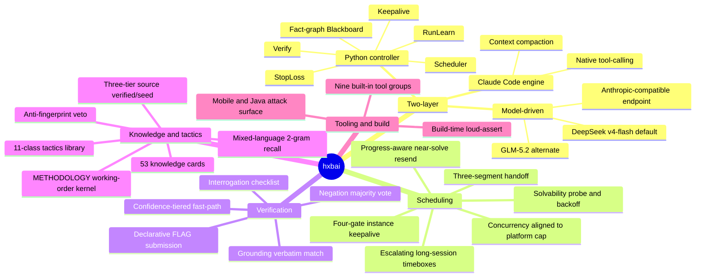

# hxbai — an autonomous security-range solving Agent

[简体中文](README.md) | **English**

hxbai is an autonomous agent for CTF / penetration ranges. Given a batch of challenges and an answer API, it runs the full chain on its own — recon, vulnerability hypothesis, exploitation, lateral movement, result verification and flag submission — with no human in the loop.

The system has two layers: a Python controller that owns fact extraction, result verification, task scheduling and cross-challenge knowledge reuse; and Claude Code as the inner execution engine that owns tool-calling and context management. Both are driven through DeepSeek's or GLM's Anthropic-compatible endpoint, and the solver and verifier share one model.

The goal is to distill solving methods and engineering that transfer across different ranges, avoiding overfitting to a single benchmark.

---

## Results · Tsecbench v1

A single model (`deepseek-v4-flash`) drove the whole run autonomously and placed **#1 with a composite score of 93.4** on Tencent Cloud Ding Lab's Tsecbench v1:

- **70 / 74** flags (94.6% accuracy), **61 / 63** challenges solved
- ~**3.5 hours** (213 minutes), 17,169 agent steps, zero human intervention
- By category: Web 18/18, Binary 13/13, Exploitation 9/9, Cloud 6/6, Evasion 14/14 all perfect; Multi-stage 10/14

Result detail (Run 2 · #11976): <https://tsecbench.zc.tencent.com/agent/11976>

Both runs side by side (Run 1 #11775 -> Run 2 #11976):

**Leaderboard**

<table>
<tr>
<td align="center"><b>Run 1</b><br></td>
<td align="center"><b>Run 2</b><br></td>
</tr>
</table>

**Benchmark detail**

<table>
<tr>
<td align="center"><b>Run 1</b><br></td>
<td align="center"><b>Run 2</b><br></td>
</tr>
</table>

---

## Architecture



---

## How a run works

The inner tool-use loop is provided by Claude Code (native tool-calling, context compaction, long-context management). The controller launches the `claude` process in headless stream-json mode, points it at DeepSeek's or GLM's Anthropic-compatible endpoint, and parses its output stream: each real command result is extracted into a source-tagged fact, and candidate flags plus their supporting output evidence are captured. The controller owns what Claude Code does not: cross-session memory, result verification, global scheduling.

A single run proceeds as follows:

1. The scheduler pulls the challenge list from the answer API and ranks it by difficulty and score.
2. Each challenge gets a working directory with a `CLAUDE.md` toolsheet and challenge context, then a Claude Code sub-session. The sub-session first runs a **solvability probe** (<=60s): if the target is unreachable and there is nothing local to analyze, it emits `INFRA_BLOCKED`, and the controller backs that challenge off instead of dispatching more sessions.
3. Every command output streams back to the controller, is extracted into source-tagged facts, and is persisted to the challenge's `MEMORY.md`.
4. Once the sub-session confirms a flag, it writes it into the workspace `FLAG` file.
5. The controller reads candidates from `FLAG`, runs three-gate verification (high-confidence candidates fast-path), and submits via the answer API.
6. Unsolved challenges are suspended and revisited in later rounds with escalating timeboxes; near-solves with a verified primitive get priority resend, eligible challenges keep their instance alive (stable IP, no reset), and sessions are chained by a three-segment handoff (achieved primitives / proven dead-ends / next step) so recon is never repeated.

---

## Key features

### Verification: three gates + confidence tiers

Before submission, each candidate flag runs three gates (`hxbai/verify.py`):

- **Grounding (pure code):** the flag must appear verbatim in some real command output, or it is judged a hallucination and rejected.
- **Negation:** an independent verifier session receives only the candidate and the **focused evidence window of the command that produced it** (not a session-opening summary), cannot see the affirmative reasoning, and tries to refute it; a majority vote rejects.
- **Interrogation:** a checklist over the source command, output uniqueness, and format match.

On top of that, candidates are tiered: one appearing verbatim and well-formed in real output is submitted directly; one grounded only case-folded or only in model narration is forced through the adversarial gates; placeholder-looking or low-entropy candidates are not submitted; a concatenated/decrypted flag may attach the raw output slices of each ingredient as its evidence form.

### Declarative submission

Submitted candidates come from what the sub-session writes into the `FLAG` file, plus flags explicitly declared in `<FinalAnswer>`. Session-ids, request-ids and binary-embedded decoy strings never enter the submit queue. Combined with dedup by flag body, stop-on-hit, and a per-challenge wrong-submit cap, the wrong-submit rate stays controlled.

### Round-based suspend and revisit scheduling

The scheduler (`hxbai/scheduler.py`, `drivers/benchmark_driver.py`) gives each unsolved challenge one visit per round, with timeboxes escalating round by round (early rounds sweep easy challenges in short sessions and suspend the hard ones; later rounds revisit with longer sessions). The timebox sequence sets the cadence only, not the total round count — revisits continue until the budget is spent or every challenge is solved or judged hopeless.

- **Solvability probe and INFRA_BLOCKED channel:** a 60s liveness probe at the start; a persistently unreachable target with nothing local emits `INFRA_BLOCKED`, and the controller backs off instead of creating a session storm.
- **Per-turn adaptive budget:** `HXBAI_SECS_PER_TURN` is a prior (flash=5 / glm=8); each session records the measured turn rate, and the next visit derives its turn budget from the measurement — so the long-session design still holds after a model swap.
- **Selective instance keepalive** (`hxbai/keepalive.py`): challenges with a verified primitive keep their instance alive (four gates: has a primitive / quota free / pending not over the limit / not in the tail); when preempted or reclaimed it degrades to an always-on "self-describing handoff + replay recipe" fallback. Not closing keeps the IP fully stable — keepalive removes the biggest source of "re-attack from scratch every wave" idle.
- **Progress awareness:** a near-solve whose access goals are met and only lacks the flag gets top priority and resend; a breakthrough at the end of a session is picked up immediately by the next.

The stop-loss governor (`hxbai/stoploss.py`) caps per-challenge spend on several axes: active wall-clock budget, consecutive fact-less sessions, consecutive unreachable visits, and **hypothesis-space repetition** (near-identical probe commands across sessions = the direction has not converged, force a strategy-class switch). Any axis hitting drops the challenge from the revisit queue. A multi-flag chain that has already banked a flag is governed instead by a "since-last-flag" window, so a near-done chain is not cut mid-way by the flat caps. Concurrency is aligned to the platform's active-instance cap.

### Cross-challenge run-learning

Challenges on one range often share infrastructure and authoring habits (WAF rules, internal naming, credential and auth patterns, product families). The controller (`hxbai/runlearn.py`) indexes techniques or environment traits confirmed on a solve by ATT&CK technique id and recalls them by fingerprint for new challenges; **negative knowledge is stored too** — proven dead-ends (tool absent, protocol cut, why a path is 403) are immunized across sessions so late sessions don't re-walk them. Only verified lessons are stored.

### Cross-visit three-segment handoff

When a hard challenge advances across multiple visits, each session ends by emitting a structured handoff: **[achieved primitives]** (minimal reproduction commands, `$TARGET`-parameterized), **[proven dead-ends]** (with a one-line why), **[next step]** (a directly runnable command / payload). The block goes to the top of `MEMORY.md`, and the next revisit starts straight from "next step" without repeating recon; the dead-ends are listed explicitly in the new session prompt. If the LLM is unavailable, the fallback synthesis degrades to pure-code (a new script inventory + the last command), so the visit loop never stalls.

### Class-based tactics library (11 classes + one working-order kernel)

Tactics playbooks (`hxbai/playbooks.py`) are organized into **11 classes** (web, pwn, crypto, cloud, reverse, forensics, misc, pentest / multi-stage, evasion, **mobile**, **blockchain**). Every class playbook is prefixed with the same **METHODOLOGY working-order kernel** (solvability probe -> full read incl. comment grep -> translate the prompt's nouns -> cheapest-decisive first -> anti-stall -> verify -> dependency-chain lookahead), so "what to do first" always has a single answer; web/pentest also attach an enterprise-component CVE catalog (ENTERPRISE). Routing goes by **file magic > protocol fingerprint > banner > wording** (.apk/.dex->mobile, .sol->blockchain, Mach-O/ELF->reverse/pwn); a multi-flag web challenge is auto-promoted to a pentest kill-chain; an unknown shape hits an UNKNOWN-SHAPE fallback instead of being forced into the closest class.

### Knowledge cards and mixed-language recall (`hxbai/knowledge/`)

53 structured exploitation cards (fingerprint / exploit steps / key payload / preconditions / verification oracle / common pitfalls) covering product-level one-shot CVEs (ComfyUI-Manager, HugeGraph, OFBiz, 1Panel, Weaver, etc.), challenge-type chains (login-injection side channel, unauthorized-download traversal, LFI log poisoning, upload-to-shell lateral movement, JWT kid forgery, detector-evasion scoring endpoints, custom-VM keygen, cloud credential chains), plus methodology cards:

- **Mixed-language 2-gram recall:** Chinese is split by adjacent-character sliding window, English by whitespace tokens, so a Chinese prompt never comes up empty; fingerprint hits are weighted x3.
- **Anti-fingerprint:** a negative signal vetoes a card outright — "looks like X but Y is present, so not this card" — preventing a wrong card from derailing the whole session.
- **Three-tier source:** verified (written back from a solve on this run) / writeup (distilled from external post-mortems, not injected on the first visit) / seed (hand cards + human-reviewed writeup cards); `force_recall` requires fingerprint >=2, or fingerprint >=1 with total score >=6, and the first visit only injects verified/seed.
- **De-identification discipline:** card content records only methods and challenge-type fingerprints, never a challenge id / instance username / narrative proper noun — so it works as-is on a new range.

### Single model and gateway mode

The solver and verifier share one provider and key. `HXBAI_PROVIDER` switches between four presets: `deepseek` (deepseek-v4-flash, default), `deepseek-1m` (deepseek-v4-pro[1m] + compression window), `glm` (glm-5.2), `glm-1m` (glm-5.2[1m]).

The same image runs both local and hosted. With `SOLVER_GATEWAY=1`, the controller rewrites the model API host to `http://<host>.tsecbench.gw` and switches https to http, for hosted environments where the model is reachable only via the platform gateway.

---

## Layout

```
Dockerfile          image build
entrypoint.sh       container entry: validate env, optional VPN, run the scheduler
requirements.txt    controller Python deps
.env.example        runtime config template
hxbai/              controller package
  ccrunner.py         launches the Claude Code sub-session, parses the stream, extracts facts + candidate flags
  verify.py           three gates + focused evidence window + confidence tiers + placeholder/low-entropy filter
  blackboard.py       source-tagged fact graph + classified ATT&CK goal chain
  attack.py           ATT&CK technique subset (shared taxonomy for goal chain / cards / run-learning)
  task.py             unified AgentTask abstraction (common entry for local and hosted drivers)
  scheduler.py        cross-challenge concurrency + best-of-N
  stoploss.py         multi-axis stop-loss (budget / no-output / unreachable / hypothesis repetition)
  keepalive.py        selective instance keepalive: four gates + quota + preemption fallback
  longtask_guard.py   long-session guard: turn-rate adaptation and session-budget derivation
  runlearn.py         cross-challenge run-learning + negative knowledge (proven dead-ends)
  playbooks.py        11-class tactics library + METHODOLOGY kernel + routing
  taskprompt.py       task-prompt assembly, CLAUDE.md toolsheet, three-segment handoff block
  config.py           provider presets, gateway rewrite, controller params (timebox / keepalive / turn rate)
  llm.py              verifier-side model client (OpenAI-compatible / zai)
  observability.py    structured event log
  oob.py              optional out-of-band callback oracle (grounding for blind-vuln classes)
  dnsfix.py           pin the answer-API hostname (two-layer protection around VPN-pushed DNS)
  kbcheck.py          knowledge-card loading / hygiene checks
  knowledge/          card library: store.py (mixed-language recall / anti-fingerprint / source tiers),
                      distill.py (writeup -> structured card), entries/ (53 cards)
drivers/
  benchmark_driver.py main driver: scheduling, long-session revisits, keepalive, INFRA_BLOCKED, declarative submit
  solve_batch.py      local batch driver
  solve_local.py      local single-challenge driver
tools/
  authspray.py        credential spraying (login brute-forcing for multi-stage intrusion)
```

---

## Toolchain

Base image `kalilinux/kali-rolling`, apt mirror -> USTC, pip mirror -> BFSU (for CN networks). The inner engine is Node 20 + `@anthropic-ai/claude-code`. Tools by category:

- **Web:** nmap, masscan, ffuf, gobuster, dirb, nikto, whatweb, sqlmap, nuclei, seclists, mitmproxy, playwright + chromium, jwt_tool
- **Pwn / Reverse:** gdb + gef + gdb-multiarch, radare2, binutils (objdump), patchelf, qemu-user-static, strace, ltrace, upx, one_gadget, seccomp-tools, Ghidra headless; pip: pwntools, capstone, unicorn, angr, z3-solver
- **Mobile:** jadx, apktool, aapt/apksigner/zipalign, adb, dex2jar
- **Crypto:** pycryptodome, sympy, gmpy2, z3-solver, fpylll (lattice)
- **Forensics / Stego / Traffic:** tshark, binwalk, foremost, exiftool, steghide, sleuthkit, volatility3, poppler-utils, tcpdump
- **Cloud / Deserialization:** boto3, awscli, cloudfox, cdk, impacket, ysoserial (Java)
- **Web3 / EVM:** web3.py, eth-account, foundry (forge/cast/anvil), slither, py-solc-x
- **Lateral / Tunneling:** chisel, proxychains4, socat, ncat, sshpass, hydra, john, hashcat
- **Source audit / git:** semgrep, bandit, ripgrep, gh CLI
- **DB clients:** mysql/mariadb client (privesc enumeration and INTO OUTFILE shell drop)

The build ends with a tool-existence loud-assert (per-item check over the opt_bin list); any missing item makes the build log fail loudly. No secrets are baked into the image — model key, answer token and VPN config all arrive via runtime env.

---

## Build and run

```bash
# build the image
docker build -t hxbai:latest .

# local run (direct internet)
docker run --rm \
  -e SOLVER_API_KEY=<model key> \
  -e BENCHMARK_TOKEN=<answer API token> \
  -e BENCHMARK_BASE_URL=<answer API url> \
  hxbai:latest

# hosted run (through the model gateway): also set SOLVER_GATEWAY=1
# BENCHMARK_TOKEN / BENCHMARK_BASE_URL are injected by the platform
```

`entrypoint.sh` validates `BENCHMARK_TOKEN` and `BENCHMARK_BASE_URL` (exits if missing), optionally brings up an in-container VPN (when `HXBAI_VPN_CONFIG` points at a mounted .ovpn), then runs `drivers/benchmark_driver.py`. Full config in `.env.example`.

---

## Runtime config

The table below is the **exact config used for the Tsecbench v1 competition run** (`.env.example` matches it):

| Variable | Meaning | Competition value |
|---|---|---|
| `SOLVER_API_KEY` | model key (shared by solver and verifier) | your key |
| `BENCHMARK_TOKEN` | answer API token (platform-injected when hosted) | injected |
| `BENCHMARK_BASE_URL` | answer API url (platform-injected when hosted) | injected |
| `HXBAI_PROVIDER` | `deepseek` / `deepseek-1m` / `glm` / `glm-1m` | `deepseek` |
| `SOLVER_GATEWAY` | hosted gateway (host + `.tsecbench.gw`, https->http) | `1` |
| `HXBAI_USE_PRO` | 0=flash (no reasoning, cheap/fast); 1=pro variant | `0` |
| `HXBAI_USE_HINTS` | platform hints (gated: never on easy, only a stuck revisit) | `1` |
| `HXBAI_ROUTE_BY_CATEGORY` | 0=shape routing (file magic > protocol > banner > wording) | `0` |
| `HXBAI_WORKING_SET` | challenges worked in parallel | `3` |
| `HXBAI_KEEPALIVE_MAX` | instance keepalive quota (0=off, fallback stays on) | `2` |
| `HXBAI_MAX_CONCURRENCY` | parallel challenges (aligned to platform active-instance cap) | `3` |
| `HXBAI_HANDOFF_LLM` | LLM-synthesized handoff block (0=code-only fallback) | `1` |
| `HXBAI_PERSIST_AUTOCARD` | persist auto-generated cards after a full solve | `0` |
| `HXBAI_VPN_KEEPALIVE` | keep the in-container VPN tunnel warm (ping / ping-restart) | `1` |
| `HXBAI_TOTAL_SECONDS` | overall wall-clock budget (seconds) | `21300` |
| `HXBAI_ROUND_TIMEBOXES` | per-round per-challenge visit seconds (escalating; rounds = count) | `480,820,1500,2000` |
| `HXBAI_INNER_LANES` | inner lanes for a multi-flag chain (1=off, 2=parallel) | `1` |
| `HXBAI_WORKDIR` | root of per-challenge working directories | `/work` |

Other optional parameters are in `.env.example`.

---

## License

Released under the **[MIT License](LICENSE)** — free for personal and commercial use. If you use it in a commercial project, a friendly heads-up via the WeChat Official Account 攻防SRC is welcome (optional, not a requirement).

```
AUTHORIZED-USE ONLY

This project (including offensive tools such as tools/authspray.py) is for security
research, education, and AUTHORIZED penetration testing / CTF use only. You must have
explicit authorization for any target; use against systems you do not own is strictly
prohibited. The author assumes no liability for any misuse.
```

## Star History

[](https://star-history.com/#inwpu/hxbai&Date)
